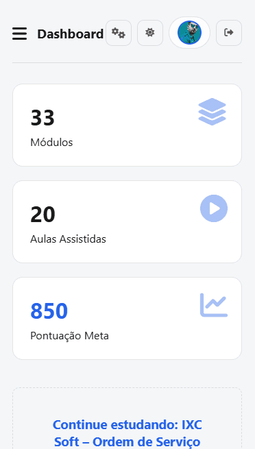
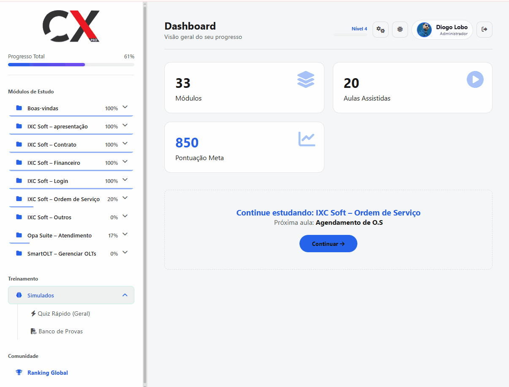
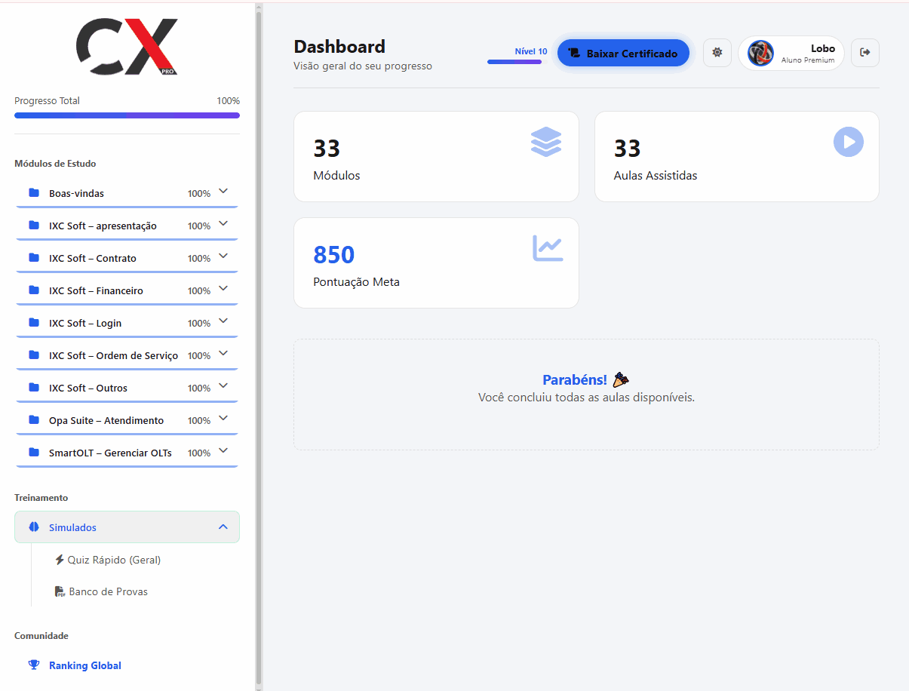
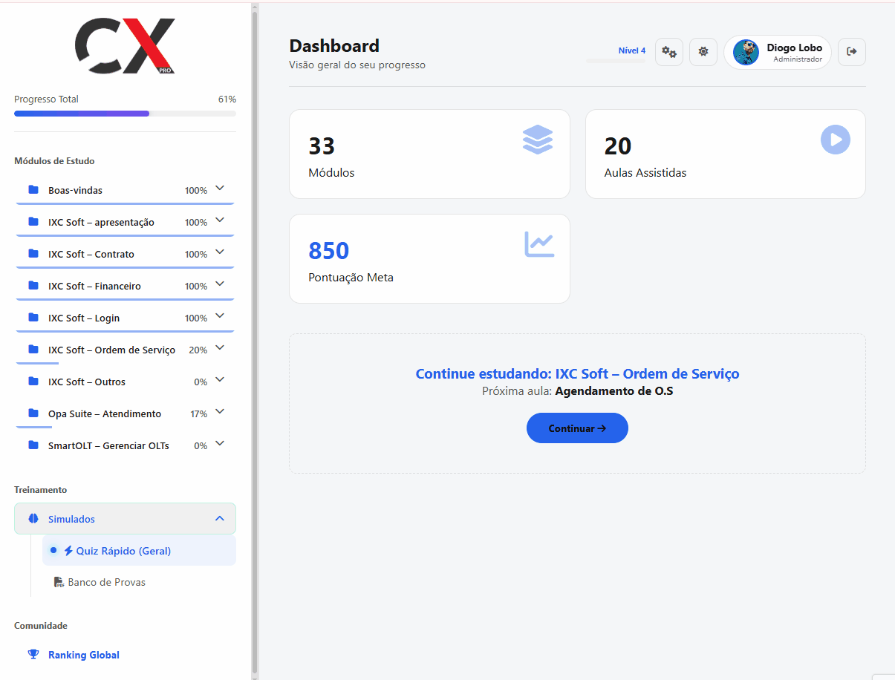

# 🚀 CXPRO — Portal de Treinamento, Wiki & LMS Corporativo

  <strong>Plataforma LMS corporativa com gamificação, segurança avançada e controle administrativo total.</strong> 
  Desenvolvida para onboarding, capacitação contínua e padronização de conhecimento.

  
  
  
  
  

---

## 🧠 Sobre o Projeto

O **CXPRO LMS** é um **Sistema de Gerenciamento de Aprendizado corporativo**, criado para empresa que precisou de:

- Treinar novos colaboradores rapidamente
- Padronizar processos e conhecimento interno
- Acompanhar progresso, desempenho e engajamento
- Garantir **segurança, controle de acesso e certificação**

Tudo isso em uma plataforma **leve, moderna, responsiva e escalável**.

---

## 🛠️ Tecnologias Utilizadas

  
  
  
  
  

### Stack Técnica
- **Frontend:** HTML5, CSS3, JavaScript (UX otimizado)
- **Backend:** PHP 8.x (PDO, arquitetura segura)
- **Banco de Dados:** MySQL (modelagem relacional)
- **Segurança:** Tokens de sessão, anti-login simultâneo
- **E-mail:** PHPMailer (reset de senha e notificações)
- **Controle de Versão:** Git & GitHub

---

## 🎯 Principais Funcionalidades

### 🎮 Gamificação
- Sistema de **XP e níveis**
- Ranking global entre alunos
- Evolução visual em tempo real

### 📚 Aprendizado Estruturado
- Módulos e aulas organizadas
- Vídeos, materiais em PDF e quizzes
- Controle de progresso individual

### 🧪 Avaliações Inteligentes
- Quizzes dinâmicos
- Feedback automático

### 🎓 Certificação
- Certificado automático ao atingir 100%
- Geração dinâmica em PDF
- Nome, curso e data personalizados

### 🛡️ Segurança Avançada
- Vigilante de sessão em tempo real
- Proteção contra compartilhamento de conta
- Tokens seguros para redefinição de senha

### 🧑‍💼 Painel Administrativo
- Aprovação manual de usuários
- Gestão de módulos, aulas e quizzes
- Controle de permissões e perfis

---

## 🖼️ Demonstração Visual

### 🎨 Interface e Experiência (UX)
| **Login & Temas** | **Mobile First** |
|:---:|:---:|
|  |  |
| *Suporte a Dark/Light Mode com memória de preferência.* | *Interface 100% responsiva para smartphones.* |

### 🎮 Gamificação e Progresso
| **Ganho de XP** | **Ranking Global** |
|:---:|:---:|
|  |  |
| *Evolução de nível e XP ao finalizar aulas.* | *Mural competitivo entre os alunos da plataforma.* |

| **Certificação** | **Sistema de Quizzes** |
|:---:|:---:|
|  |  |
| *Liberação do certificado após 100% de conclusão.* | *Testes dinâmicos com feedback de gabarito inteligente.* |

### 🛡️ Segurança e Administração
| **Vigilante de Sessão** | **Painel Administrativo** |
|:---:|:---:|
|  |  |
| *Anti-compartilhamento de conta em tempo real.* | *Gestão centralizada de módulos, aulas e usuários.* |

| **Gestão de Usuários** | **Downloads & Materiais** |
|:---:|:---:|
|  |  |
| *Aprovação manual de novos cadastros pelo ADM.* | *Central organizada para download de PDFs e provas.* |

| **Cadastro de Aluno** | **Recuperação de Senha** |
|:---:|:---:|
|  |  |
| *Fluxo de registro intuitivo para novos alunos.* | *Reset seguro via e-mail com tokens temporários.* |

| **Notificação por E-mail** | **Edição de Perfil** |
|:---:|:---:|
|  |  |
| *Design Neon Dark para e-mails de aprovação.* | *Gestão de avatar e dados pessoais pelo aluno.* |

---

## 🛠️ Instalação e Configuração Local

1.  **Clone o repositório:** `git clone https://github.com/DioLobo/Wikicx.git`
2.  **Servidor Local:** Mova a pasta para o `htdocs` (XAMPP) ou `www` (Wamp).
3.  **Banco de Dados:** Importe o arquivo `seu banco.sql` através do PHPMyAdmin.
4.  **Configuração:** Renomeie o arquivo `.env.example` para `.env` e insira suas credenciais do banco.

---
Para avaliar as funcionalidades administrativas e de aluno, utilize as credenciais abaixo integradas ao arquivo `seu banco.sql`:

| Nível de Acesso | Usuário (E-mail) | Senha | Status |
| :--- | :--- | :--- | :--- |
|  | `teste@gmail.com` | `password` |  |

> **Nota:** A conta de administrador possui permissão para aprovar novos cadastros e gerenciar o conteúdo no diretório `/admin`.

---

### 📂 Estrutura de Arquivos Críticos
Abaixo estão os arquivos fundamentais que compõem a arquitetura de segurança e interface.

#### 🛠️ Configurações e Segurança
* **`config/db.php`**: Responsável pela conexão PDO com o banco de dados e pela sincronização do Timezone (fuso horário).
* **`config/session_check.php`**: Atua como o **"Vigilante"** do sistema, validando o token de sessão do usuário a cada interação.
* **`api/check_session.php`**: Endpoint que permite ao JavaScript identificar sessões expiradas e encerrá-las em tempo real.

#### 🖥️ Interfaces Principais
* **`admin_usuarios.php`**: Painel administrativo centralizado para gerenciamento de contas e permissões.
* **`index.php`**: Dashboard principal responsivo para visualização de métricas e controle de acessos.

---

## 🤝 Contato

---
